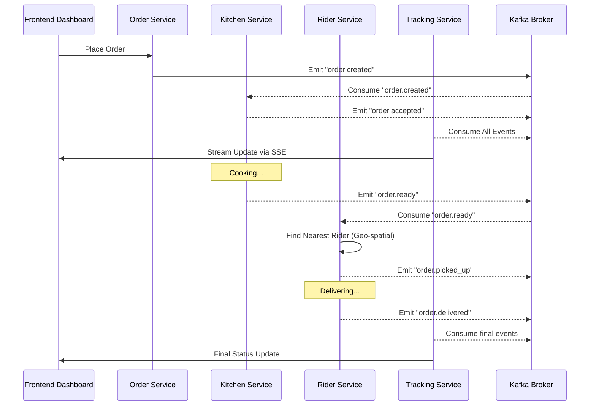

# Food Delivery POC (Kafka + Fastify + MongoDB + Redis + React)

This project is a high-performance, event-driven Proof of Concept for a food delivery system.

## Architecture

1.  **Order Service**: Places orders, caches restaurant data in Redis, saves to MongoDB, and produces `order.created`.
2.  **Kitchen Service**: Consumes `order.created`, simulates food prep, produces `order.accepted` and `order.ready`.
3.  **Rider Service**: Consumes `order.ready`, finds the nearest rider using MongoDB **`2dsphere`** indexing, produces `order.picked_up` and `order.delivered`.
4.  **Tracking Service**: Aggregates all events and streams them via Server-Sent Events (SSE).
5.  **Frontend Dashboard**: Visualizes order progress and displays a live "Kafka Log" terminal.

## How it Works (Architecture Flow)



## Tech Stack
- **Backend**: Fastify (Node.js), TypeScript, KafkaJS, Mongoose, IORedis.
- **Frontend**: React, Vite, TailwindCSS.
- **Broker**: Kafka & Zookeeper (Bitnami).
- **Databases**: MongoDB (Persistence & Geospatial), Redis (Caching).

## Quick Start

```bash
# Start the entire cluster with hot-reloading (Docker Compose Watch)
docker compose up --build --watch
```

## Simulation Commands

### 1. Place an Order
```bash
curl -X POST http://localhost:3000/api/orders \
  -H "Content-Type: application/json" \
  -d '{"items": ["Pizza", "Coke"], "restaurantId": "rest_123", "location": {"lat": 40.7128, "lng": -74.0060}}'
```

### 2. Update Rider Location (to test geospatial search)
```bash
curl -X POST http://localhost:3002/api/riders/update-location \
  -H "Content-Type: application/json" \
  -d '{"riderId": "rider_1", "location": [40.7120, -74.0050]}'
```

## MongoDB Advanced Indexing

### `2dsphere` Index
In the `rider-service`, we use a `2dsphere` index to perform geospatial queries. This allows us to find the closest available rider to a restaurant in milliseconds, even with millions of riders.

Example Query:
```javascript
const nearestRider = await Rider.findOne({
  location: {
    $near: {
      $geometry: { type: "Point", coordinates: [lng, lat] },
      $maxDistance: 5000 // 5km
    }
  },
  isAvailable: true
});
```

### Compound Index
In the `order-service`, we use a compound index on `restaurantId` and `status` to optimize order management dashboards for restaurant owners.
